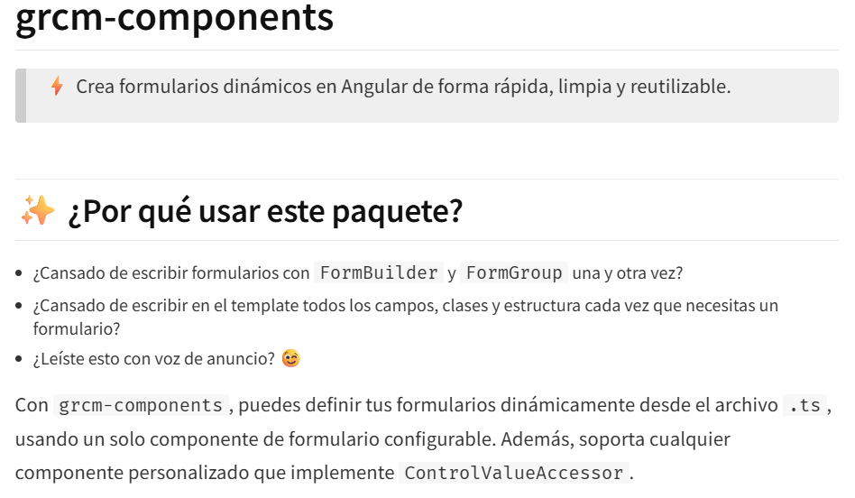

<h1 align="left">Hola 👋, soy <a href="guillercm">

    
  
  </a>

</h1>

 

## Sobre mi

<!-- - 🌱 Actualmente estoy aprendiendo **java** -->
- 👨‍💻 Todos mis proyectos están disponibles en [https://guillercm.github.io/guillercm/](https://guillercm.github.io/guillercm/)
- 📫 Puedes contactarme con **guillermo.ruiz.cortina.martinez@gmail.com**
 

## Tecnologías

    
### Lenguajes base para la web

### Estilos y frameworks de diseño

### Frameworks y librerías de desarrollo frontend

### Librerías UI para Angular

### Librerías de Angular/React

### Frameworks y lenguajes backend

### Bases de datos relacionales y NoSQL

### Simulación de APIs y tiempo real

### Herramientas de testing

### Lenguajes de programación adicionales

### Repositorios remotos y control de versiones

 

## Mis proyectos
<table><tr><table><tr><td width="50%">
                    <h3 align="center">La carrera por la dona</h3>
                    

                        
                        
Juego de mesa multijugador inspirado en Los Simpsons, hecho con Angular, Socket.IO y json-server. Compite en un tablero lleno de desafíos estilo party game.

                            &nbsp;&nbsp;&nbsp;&nbsp;&nbsp;&nbsp;&nbsp;&nbsp;

                          
                        

                    

                </td> <td width="50%">
                    <h3 align="center">Componente de formulario</h3>
                    

                        
                        
Un componente para la creación de formularios dinámicos. Está subido a NPM, cualquier desarrollador se lo podrá descargar y usar.

                            &nbsp;&nbsp;&nbsp;

                          
                        

                    

                </td> </tr></table><table><tr><td width="50%">
                    <h3 align="center">Angular</h3>
                    

                        
                        
Aplicación que reúne mis apuntes, PDFs, mini aplicaciones y contenido de dos cursos recientes de Angular. Incluye componentes, servicios y otras utilidades que luego reutilizo en mis proyectos.

                            &nbsp;&nbsp;&nbsp;&nbsp;&nbsp;&nbsp;&nbsp;&nbsp;&nbsp;&nbsp;&nbsp;

                          
                        

                    

                </td> <td width="50%">
                    <h3 align="center">Club náutico</h3>
                    

                        
                        
Aplicación para gestionar barcos, sus respectivas salidas con un capitán determinado y con un horario.

                            &nbsp;&nbsp;&nbsp;

                          
                        

                    

                </td> </tr></table><table><tr><td width="50%">
                    <h3 align="center">Royalmon</h3>
                    

                        
                        
Un juego que combina el mundo de pokemon con el del clash royale. ¡Captura todos los royalmons y consigue todas las medallas de gimnasio!

                            &nbsp;&nbsp;&nbsp;

                          
                        

                    

                </td> <td width="50%">
                    <h3 align="center">No He Sido Yo</h3>
                    

                        
                        
Un juego multijugador de preguntas de temáticas a elegir sobre hipotéticas situaciones. El funcionamiento multijugador está echo con ficheros de texto usando php, ya que en su día no conocía los sockets.

                            &nbsp;&nbsp;&nbsp;&nbsp;&nbsp;

                          
                        

                    

                </td> </tr></table><table><tr><td width="50%">
                    <h3 align="center">PlantasVsZombis</h3>
                    

                        
                        
Divertido juego de estrategia que consiste en matar a todos los zombis antes de que lleguen a tu casa. Recolecta soles para comprar plantas y defenderte.

                            &nbsp;&nbsp;&nbsp;

                          
                        

                    

                </td> 

 
<!--
### ⚙️ &nbsp;GitHub Analytics

-->
