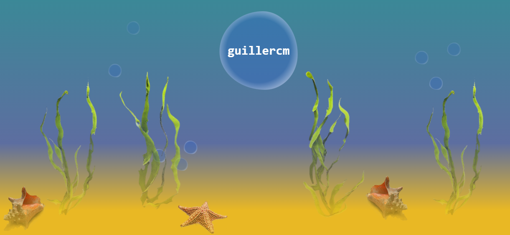
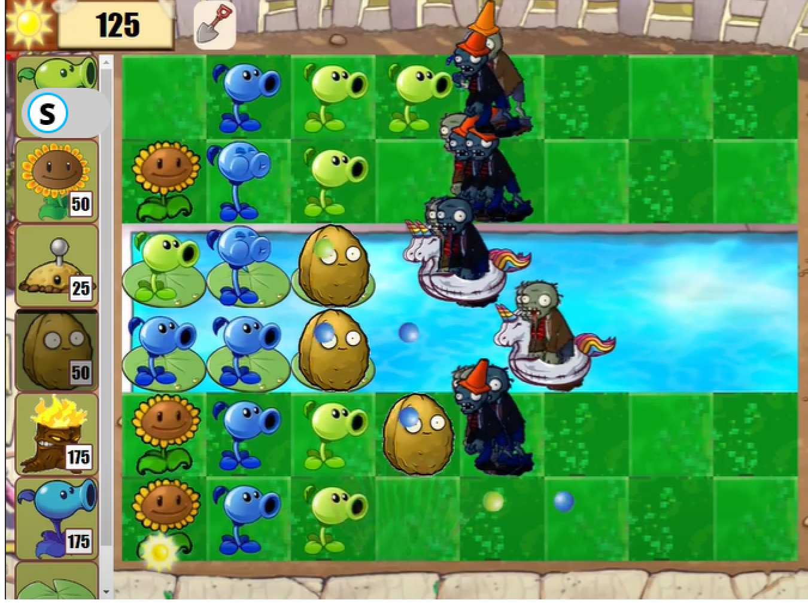

<h1 align="left">Hola 👋, soy <a href="https://guillercm.github.io/guillercm/">

    
  
  </a>

</h1>

 

## Sobre mi

<!-- - 🌱 Actualmente estoy aprendiendo **java** -->
- 👨‍💻 Todos mis proyectos están disponibles en [https://guillercm.github.io/guillercm/](https://guillercm.github.io/guillercm/)
- 📫 Puedes contactarme con **guillermo.ruiz.cortina.martinez@gmail.com**
 

## Tecnologías

### Las que más domino

    

### Otras tecnologías

    

 

## Mis proyectos
<table><tr><table><tr><td width="50%">
                    <h3 align="center">Royalmon</h3>
                    

                        
                        
Un juego que combina el mundo de pokemon con el del clash royale. ¡Captura todos los royalmons y consigue todas las medallas de gimnasio!

                        

                            <a href="https://angular.io/" target="_blank" rel="noreferrer">
                                        
                                    </a><a href="https://spring.io/projects/spring-boot" target="_blank" rel="noreferrer">
                                        
                                    </a><a href="https://www.mysql.com/" target="_blank" rel="noreferrer">
                                        
                                    </a>
                        

                        

                            
                        

                    
                                                                             
                </td> <td width="50%">
                    <h3 align="center">PlantasVsZombis</h3>
                    

                        
                        
Divertido juego de estrategia que consiste en matar a todos los zombis antes de que lleguen a tu casa. Recolecta soles para comprar plantas y defenderte.

                        

                            <a href="https://developer.mozilla.org/es/docs/Web/HTML" target="_blank" rel="noreferrer">
                                        
                                    </a><a href="https://developer.mozilla.org/es/docs/Web/CSS" target="_blank" rel="noreferrer">
                                        
                                    </a><a href="https://developer.mozilla.org/en-US/docs/Web/JavaScript" target="_blank" rel="noreferrer">
                                        
                                    </a>
                        

                        

                            
                        

                    
                                                                             
                </td> </tr></table><table><tr><td width="50%">
                    <h3 align="center">Club náutico</h3>
                    

                        
                        
Aplicación para gestionar barcos, sus respectivas salidas con un capitán determinado y con un horario.

                        

                            <a href="https://angular.io/" target="_blank" rel="noreferrer">
                                        
                                    </a><a href="https://spring.io/projects/spring-boot" target="_blank" rel="noreferrer">
                                        
                                    </a><a href="https://www.mysql.com/" target="_blank" rel="noreferrer">
                                        
                                    </a>
                        

                        

                            
                        

                    
                                                                             
                </td> <td width="50%">
                    <h3 align="center">No He Sido Yo</h3>
                    

                        
                        
Un juego online divertido de preguntas de temáticas a elegir sobre hipotéticas situaciones para jugar con tus amigos

                        

                            <a href="https://developer.mozilla.org/es/docs/Web/HTML" target="_blank" rel="noreferrer">
                                        
                                    </a><a href="https://developer.mozilla.org/es/docs/Web/CSS" target="_blank" rel="noreferrer">
                                        
                                    </a><a href="https://developer.mozilla.org/en-US/docs/Web/JavaScript" target="_blank" rel="noreferrer">
                                        
                                    </a><a href="https://www.php.net/" target="_blank" rel="noreferrer">
                                        
                                    </a><a href="https://www.mysql.com/" target="_blank" rel="noreferrer">
                                        
                                    </a>
                        

                        

                            
                        

                    
                                                                             
                </td> </tr></table>

 
<!-- 
### ⚙️ &nbsp;GitHub Analytics

-->

